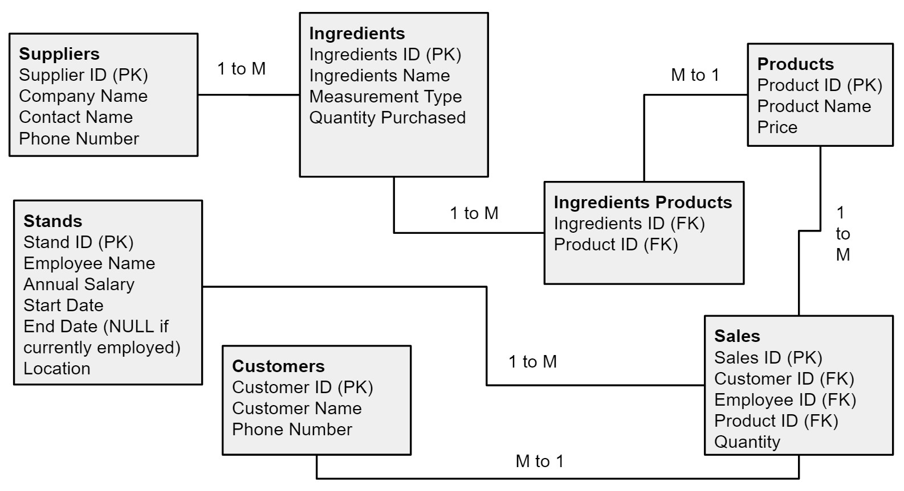

# MIS3545_A2
Assignment 2

## Lemonade Stand, Inc.
**Lemonade Stand, Inc.** is the fastest-growing seller of freshly prepared lemon beverages in North America. The owner, Billy-Bob Jones, employs 5 industry-leading salespeople each operating his or her own lemonade stand. By use of predatory pricing tactics and business analytics, Lemonade Stand, Inc. aims to eliminate all small lemonade stand owners from the industry.

## Entity Relationship Diagram

### Assumptions
* Each supplier can supply multiple ingredients, but each ingredient only comes from one supplier
* Each stand has only one dedicated salesperson, as a result of which the employee can be described in the Stand table
* Our company currently only sells 1 product
